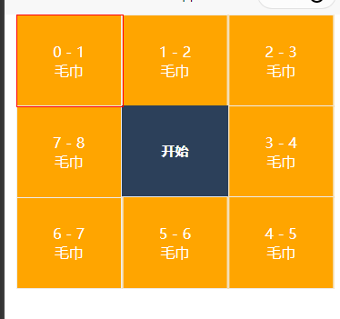
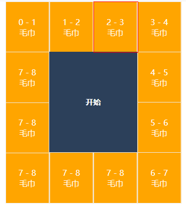

# grid-lottery ( uni-app 九宫格抽奖 )

> 基于 Hbuilder X 2.9.8 实现

一个使用 vue 开发的九宫格抽奖插件, 允许使用完全自定义样式, 均为 slot 插槽

## ScreenShots

<p float="left">


</p>

## Getting started

直接复制 grid-lottery.vue 到项目中。

### mehods

- `start： (id: string|number, minTime: number)=>void` : 开始抽奖， 传入中奖 id，与旋转时间
- `place: (index:number)=>{x: number, y: number}`: 获取索引定位

### options

- `list: [{id: string | number, sort?: number, }]` : 列表数据, sort 为奖项实际排序， 数组长度尽量为 8/12/16/22 以此类推
- `itemHeight: number` : 奖项外框高度
- `itemHeightUnit: string` : 高度单位
- `interval: number`: 转盘转动间隔
- `maxInterval: number`: 最大转盘转动间隔
- `isIntervalIncrease: boolean`: 是否逐渐减速
- `intervalIncreaseStartTime: number`: 减速开始时间
- `onStart: () => void` : 点击开始触发
- `onEnd: (item: T) => void`: 抽奖结束后触发

## Usage Example

```vue
<template>
  <view class="content">
    <grid-lottery
      itemHeight="200"
      ref="gridLotteryRef"
      style="width: 350px;"
      :list="list"
      @onStart="onStart"
      @onEnd="onEnd"
    >
      <!-- <view slot="lottery-item" slot-scope="slotProps">{{ slotProps }}</view> -->
      <template slot="lottery-item" slot-scope="{ test }">
        <view class="lottery-item">
          <view>{{ test.sort }} - {{ test.id }}</view>
          <view>{{ test.title }}</view>
        </view>
      </template>
      <view slot="start-button" class="start-button">开始</view>
      <view slot="activity-box" class="activity-box"></view>
    </grid-lottery>
  </view>
</template>

<script>
import gridLottery from '@/components/grid-lottery.vue'
export default {
  components: {
    gridLottery
  },
  data() {
    return {
      list: [
        {
          id: 1,
          sort: 0,
          title: '\u6BDB\u5DFE'
        },
        {
          id: 2,
          sort: 1,
          title: '\u6BDB\u5DFE'
        },
        {
          id: 3,
          sort: 2,
          title: '\u6BDB\u5DFE'
        },
        {
          id: 4,
          sort: 3,
          title: '\u6BDB\u5DFE'
        },
        {
          id: 5,
          sort: 4,
          title: '\u6BDB\u5DFE'
        },
        {
          id: 6,
          sort: 5,
          title: '\u6BDB\u5DFE'
        },
        {
          id: 7,
          sort: 6,
          title: '\u6BDB\u5DFE'
        },
        {
          id: 8,
          sort: 7,
          title: '\u6BDB\u5DFE'
        },
        {
          id: 8,
          sort: 7,
          title: '\u6BDB\u5DFE'
        },
        {
          id: 8,
          sort: 7,
          title: '\u6BDB\u5DFE'
        },
        {
          id: 8,
          sort: 7,
          title: '\u6BDB\u5DFE'
        },
        {
          id: 8,
          sort: 7,
          title: '\u6BDB\u5DFE'
        }
      ]
    }
  },
  onLoad() {},
  methods: {
    onStart() {
      this.$refs.gridLotteryRef.start(3, 10000)
    },
    onEnd(item) {
      console.log(item)
    }
  }
}
</script>

<style scoped>
.content {
  display: flex;
  flex-direction: column;
  align-items: center;
  justify-content: center;
}
.lottery-item {
  background-color: orange;
  color: #fff;
  height: 200rpx;
  border: 1px solid #ededed;
  display: flex;
  align-items: center;
  justify-content: center;
  flex-direction: column;
}
.activity-box {
  border: 1px solid red;
  width: 100%;
  height: 200rpx;
}
.start-button {
  background-color: #2c405a;
  color: #fff;
  text-align: center;
  font-size: 30rpx;
  line-height: 400rpx;
  font-weight: bold;
}
</style>
```
